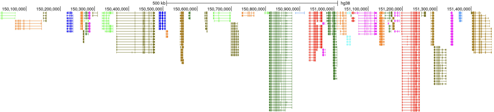

<p align="center">
  <h1 align="center">
    packbed
  </h1>

  <p align="center">
    <a href="https://img.shields.io/badge/version-0.0.1dev-green" target="_blank">
      
    </a>
    <a href="https://crates.io/crates/packbed" target="_blank">
      
    </a>
    <a href="https://github.com/alejandrogzi/packbed" target="_blank">
      
    </a>
    <a href="https://crates.io/crates/packbed" target="_blank">
      
    </a>
  </p>


  <p align="center">
    pack a .bed into overlapping components
  </p>

</p>

<p align="center">
    
</p>


## Features
- pack any number of .bed files into overlapping components through a binary, Rust library or Python module
- write a unique overlapping-component-colorized bed file out of any number of .bed files through a binary, Rust library or Python module
- split components into separate .bed files through a binary, Rust library or Python module
- write serialized components to a binary file through a binary and Rust library
- read serialized components from a binary file through a Rust library or Python module
- write specific components each to a different .bed file through a Rust library or Python module

## Usage
### Binary
``` bash
Usage: packbed [OPTIONS] --bed <PATHS>... --output <PATH>

Arguments:
    -b, --bed <PATHS>...     Paths to BED12 files delimited by comma
    -o, --output <PATH>      Path to output BED12 file [not required if -c flag is set]

Options:
    -t, --threads <THREADS>  Number of threads [default: 8]
    --type <TYPE>   Type of output [default: bed] [possible values: bin, comp, bed]
    --overlap_cds   Flag to overlap only cds regions
    -s, --subdirs   Flag to split components into separate BED files in subdirectories
    --colorize      Flag to colorize components in output BED(s) file
    -h, --help      Print help
    --version:      Print version
```

> [!TIP]
> If you want to get components in separate .bed files use:
> ```bash
> packbed -b path/to/b1.bed,path/to/b2.bed -o path/to/output --type comp
> ```
> in case you want to send each component to a different subdirectory (good to parallelize processes):
> ```bash
> packbed -b path/to/b1.bed,path/to/b2.bed -o path/to/output --type comp -s
> ```
> if you want to colorize the components but send them all to just 1 file:
> ```bash
> packbed -b path/to/b1.bed,path/to/b2.bed -o path/to/output --colorize --type bed
> ```

### Library
``` rust
use packbed::packbed;

fn main() {

    let bed1 = PathBuf::new("/path/to/b1.bed");
    let bed2 = PathBuf::new("/path/to/b2.bed");
    let beds = vec![bed1, bed2];

    let overlap_cds = true;
    let colorize = true;

    let comps: HashMap<String, Vec<Vec<Arc<GenePred>>>> = packbed(
                        beds,
                        overlap_cds,
                        colorize)
                        .unwrap();
}
```
### Python
build the port to install it as a pkg:
```bash
git clone https://github.com/alejandrogzi/packbed.git && cd packbed/py-packbed
hatch shell
maturin develop --release
```
use it:
``` python
from packbed import pack

beds = ["path/to/bed1.bed", "path/to/bed2.bed"]
comps = pack(beds)
```

<p align="center">
    
</p>

#### crate: [https://crates.io/crates/packbed](https://crates.io/crates/packbed)
