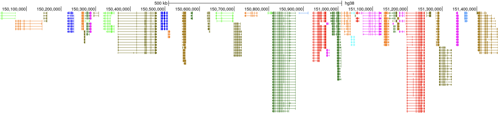

<p align="center">
  <h1 align="center">
    packbed
  </h1>

  <p align="center">
    <a href="https://img.shields.io/badge/version-0.0.13-green" target="_blank">
      
    </a>
    <a href="https://crates.io/crates/packbed" target="_blank">
      
    </a>
    <a href="https://github.com/alejandrogzi/packbed" target="_blank">
      
    </a>
    <a href="https://crates.io/crates/packbed" target="_blank">
      
    </a>
  </p>

  <p align="center">
    pack a .bed into overlapping components
  </p>

</p>

<p align="center">
    
</p>

## Features

- pack any number of .bed files into overlapping components through the Rust library or Python package
- automatically detect BED3, BED4, BED5, BED6, BED8, BED9, and BED12+ inputs
- group overlaps by exon, CDS, or transcript boundaries
- annotate inputs as reference or query records during packing
- expose Python conversion of packed Rust components as dictionaries of `GenePred` objects

> What's new on packbed v0.0.13!
>
> - Supports mixed BED widths
> - Adds a conversion-only Python package API

## Usage

### Binary

``` bash
Usage: packbed [OPTIONS] --bed <PATHS>... --mode <MODE>...

Options:
    -b, --bed <PATHS>...       Paths to BED files delimited by comma
    -m, --mode <MODE>...       Mode for each BED file [R/r/reference or Q/q/query]
    -t, --threads <THREADS>    Number of threads
    --overlap_type <TYPE>      Type of overlap [default: exon] [possible values: exon, cds, bounds, boundary]
    -s, --subdirs <FLAG>       Flag reserved for splitting components into subdirectories
    -h, --help                 Print help
    -V, --version              Print version
```

```bash
packbed -b path/to/reference.bed,path/to/query.bed -m reference,query --overlap_type exon
```

### Library

``` rust
use std::path::PathBuf;

use packbed::{pack, OverlapType, Role};

fn main() -> Result<(), Box<dyn std::error::Error>> {

    let bed1 = PathBuf::from("/path/to/reference.bed");
    let bed2 = PathBuf::from("/path/to/query.bed");
    let beds = vec![bed1, bed2];
    let roles = vec![Role::Reference, Role::Query];

    let _comps = pack(beds, roles, OverlapType::Exon)?;

    Ok(())
}
```

### Python

Install from PyPI once releases are published:

```bash
pip install py-packbed
```

Or build the local port during development:

```bash
git clone https://github.com/alejandrogzi/packbed.git && cd packbed/py-packbed
python -m venv .venv
source .venv/bin/activate
python -m pip install maturin
maturin develop --release
```

use it:

``` python
import packbed

beds = ["path/to/bed1.bed", "path/to/bed2.bed"]
roles = ["reference", "query"]
comps = packbed.pack(beds, roles, overlap_type="exon")
```

### crate: [https://crates.io/crates/packbed](https://crates.io/crates/packbed)

## Changelog

See [assets/changelog/changelog.md](assets/changelog/changelog.md) for the full release history.
